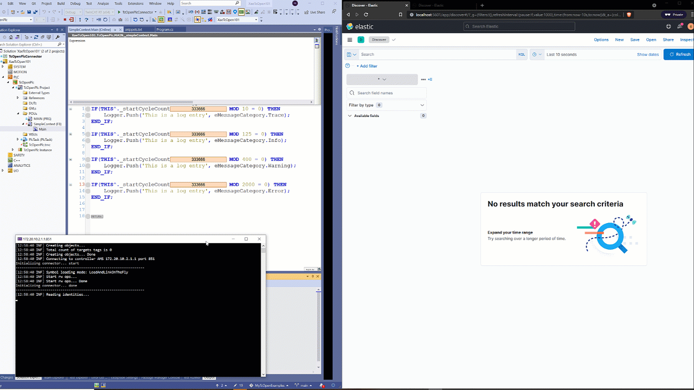

# TcOpen Examples

*Here you find a series of examples that are result of free rolling video recoding.
I explain some concepts of TcOpen framework.*

**TcOpen is open source project for industrial automation PLC project. It is developed 
here on github: [TcOpen](https://github.com/TcOpenGroup/TcOpen)**

- [TcOpen Examples 101-1](TcOpen101-1/) TcoContext and TcoLogger

- [TcOpen Examples 101-2](TcOpen101-2/) TcoObject and TcoMessenger

# If you have any issues please report in TcOpenGroup/TcOpen project [here](https://github.com/TcOpenGroup/TcOpen/issues).

[TcOpen Examples 101-1](TcOpen101-1/) TcoContext and TcoLogger

[TcOpen Examples 101-2](TcOpen101-2/) TcoObject and TcoMessenger

