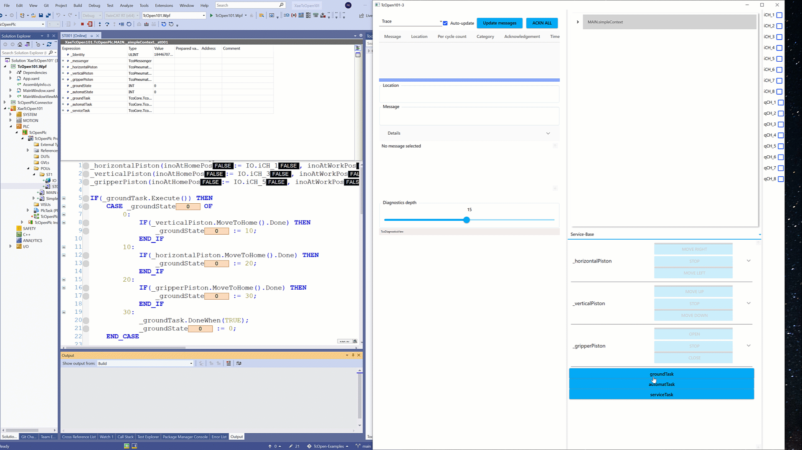

# TcOpen Examples 101-2

This is folder contains the project that is the result of free rolling coding session recorded [here](https://youtu.be/_-VYaQoz9_I)

## Here we explain

### TcoOpen

- TcoTask

### Addtional resources

[TcoTask-Concept](https://docs.tcopengroup.org/articles/TcOpenFramework/application.html#task)

[TcoTask-API](https://docs.tcopengroup.org/api/TcoCore/PlcDocu.TcoCore.TcoTask.html)
